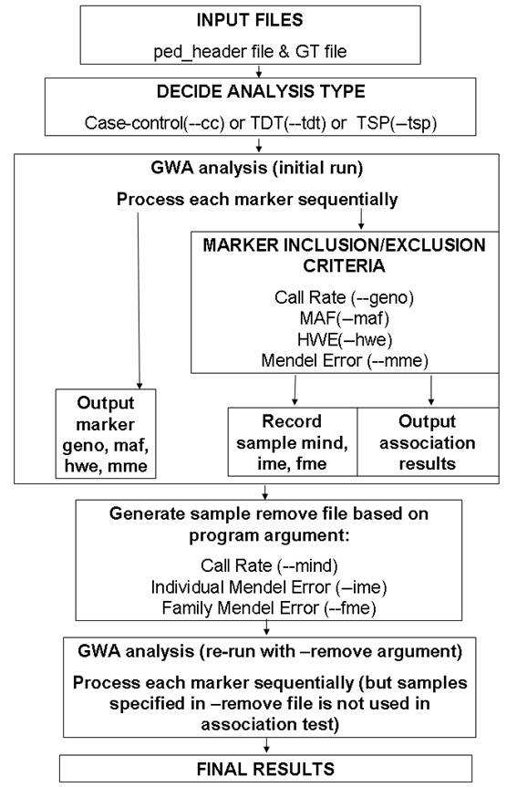

## Introduction

The `calculate_association.pl` program was originally developed in 2006 to perform simple TDT association tests. However, it has gradually evolved into a more sophisticated program for case-control analysis and quantitative traits regression analysis as well. There are certainly many other GWAS analysis software (such as PLINK), but there are several distinct features of the `calculate_association.pl` program:

- This program is written mostly in Perl (the statistics part is implemented in C and compiled into a Perl module), suggesting that it is very powerful in text processing and that the source code is easily modifiable by other users.
- This program does NOT use a traditional PED file; instead, it uses either a GT file that contains one marker per line and one individual per column, or use the PLINK-formatted TPED file that contains one marker per line as well. This indicates that it is naturally capable of processing genotype calls generated from high-density SNP genotyping platforms without complicated file format conversion (which usually involves matrix transposition), and it is capable of analyzing data set that is already processed by the PLINK software with little effort in format conversion.
- The program generates rich annotation information in outputs to facilitate biological interpretation of association results.
- It implements several permutation schemes to calculate P-values on permutated data sets, and these permuted test statistics can be coupled with the `calculate_gsea.pl` program for pathway-based association tests on GWAS.
- Finally, this program use disk scanning rather than memory scanning to process each marker sequentially; in principle, it is capable of performing association tests on millions of markers upon 1 million individuals in a typical modern computer. (To give an example where this is important: in a typical modern computer with 4GB memory, the maximum amount of genotype information that PLINK can handle is 20K individuals on 550K markers, or only 4000 individuals on 2.5 million imputated markers)

However, the functionality of the program is restricted to simple single-marker association tests. It is unable to offer more complicated testing options (such as population structure inference, multi-marker tests) available from other software. As this program is constantly under development, another problem with the program is that future versions may not generate identical results as the current version, and the command line options may not be backward compatible. Finally, as the program has not been widely used, it may contain many un-identified bugs, and may potentially generate biased results. Therefore, it is advised to use different software to test the same data set, and if the results are discordant, it may indicate the presence of a bug. Of course, it would be appreciated if users can send bug reports (if you find some) or other comments to me, and I will try my best to improve the program.

To read the detailed documentation of the program, one can use the --man argument when running the program. To see a list of arguments and their functionalities, one can use the --help argument when running the program. When the program is issued without arguments, it will print out abbreviated usage information, including supported arguments (Try to do it now to see a list of currently supported arguments and their functions).

Note that you can use both double dash or single dash in the command line (so `--output` has the same meaning as `-output`), and you can omit trailing letters of the argument as long as there is no ambiguity with another argument (so the `--output` argument has the same meaning as the `-o` or `-ou` or `-out` or `-outp` or `-outpu` argument).

## General overview of two-pass procedure



A general overview of the two-pass procedure used in this program is given in the above figure.

Unlike other GWA software that read genotype data for all individuals into memory as a large matrix, the calculate_association.pl program scan the genotype file and process each line (each marker) sequentially. Therefore, although the marker inclusion/exclusion criteria can be used during association test, the individual inclusion/exclusion criteria cannot be applied during the initial run; instead, after the initial run is finished, the individuals failing inclusion criteria will be written to a --remove file, so that in the second run of the program, these individuals are excluded from analysis.
                                                                                                                                                     
To summarize, the `calculate_association.pl` uses good-quality markers to calculate inclusion/exclusion statistics for each individual during the initial run, and then apply the inclusion/exclusion criteria during the second run. It is still possible that during the second run, some more individuals no longer meet the inclusion criteria (because the good-quality markers may change in the second run due to the removal of certain individuals); however, in general it should not a concern. Of course, if many individuals fail to meet the inclusion criteria after the second run, the user can always issue a third run if deemed necessary.

I am unable to find the documentation on how exactly other software handles the issue of simultaneous inclusion/exclusion criteria for both markers and individuals. However, I think the two-pass procedure outlined above does make practical sense.

## Input files

The program requires two main input files, a ped_header file and a GT file. Alternatively, to facilitate PLINK users to use the program, it also accepts the input files generated by the `--transpose` argument in PLINK (TFAM file and TPED file): if you have used PLINK to analyze your data, see the section below for more details on how to generate TFAM/TPED files.

These data formats are briefly described below:

### - `ped_header` file

The ped_header file can be considered a superset of the normal PED file used in most genetic analysis. It is a tab-delimited text file that records information in one line for each individual, and the first six columns of the line are family id, individual id, father id, mother id, sex and affection status (or quantitative trait). The following columns can be other phenotypes or covariates or genotypes or any information (such as race, name, address, etc) one wants to include.

An example of a ped_header file is shown below:

```
      AU0215  AU021503        AU021502        AU021501        1       2      White AA
      AU0215  AU021502        0       0       1       1 Mixed BB
      AU0215  AU021501        0       0       2       1 White AB
      AU0215  AU021504        AU021502        AU021501        1       1      Black AA
      AU0285  AU028504        AU028502        AU028501        2       2      Unknown      BB
      AU0285  AU028505        AU028502        AU028501        2       1      Unknown      AB
      AU0285  AU028501        0       0       2       1 White AA
      AU0285  AU028503        AU028502        AU028501        2       2      White BB
      AU0285  AU028502        0       0       1       1 White AB
      AU0121  AU012104        AU012102        AU012101        2       2      White AB
```

In addition to the first 6 columns seen in a typical PED file, there are two extra columns: one specifying race, and the other specifying the genotype of a SNP marker. These two extra columns can be covariates in association analysis.

Many more additional columns can be added in the file following the first 6 columns; therefore, it is even possible to use a regular PED file containing all SNP genotypes as a ped_header file. However, it is definitely not recommended to do so; instead one can use `cut -f 1-6` command instead to generate a ped_header file from a regular PED file (if it is tab-delimited).

### - GT file

The GT file is a genotype file that contains information for one marker per line. In a canonical GT file, the first three columns for the file are markerid, chromosome and position, while the following columns contain the genotypes for each individual.

To explain this in more detail, see the first 10 lines of a canonical GT file below:

```
      Name    Chr     Position        sample1        sample2        sample3        sample4        sample5        sample6        sample7
      rs10013542      4       60194938        BB      BB      BB      BB      BB      BB      BB
      rs10013547      4       175988420       BB      BB      BB      BB      BB      BB      BB
      rs10013571      4       28821638        AA      AA      AA      AA      AB      AA      AB
      rs10013576      4       27228651        AB      BB      AB      AB      BB      BB      BB
      rs10013588      4       132717336       AA      AA      AA      AA      AA      AA      AA
      rs10013604      4       43295922        AA      AB      AB      AB      AA      AA      AA
      rs1001362       16      55232359        BB      BB      AB      AB      AB      BB      BB
      rs10013632      4       117373068       AA      AA      AA      AA      AA      AA      AA
      rs10013649      4       162694792       AA      AA      AA      AA      AA      AA      AA
      rs10013727      4       142935271       AB      AB      BB      AB      BB      BB      BB
```

Each line contains 10 tab-delimited columns, and the first three columns are general description of the SNP marker, while the rest columns are the genotypes of the markers. Note that it is okay to have one space between the two alleles in a genotype call (so “AB” and “A B” are both valid genotype calls).

The format for the GT file can be slightly relaxed by the `--illumina_gtfile_format` and `--affymetrix_gtfile_format` arguments. In the case of Illumina GT file, one can simply export selected columns in the FullDataTable from the BeadStudio software as a GT file, without conforming to the strict criteria for a canonical GT file; instead, the definition of columns can be read from the first line of the GTfile. Missing genotypes can be specified as NC, --, 00 or 0.

The first 10 lines of an illumina-GT file is shown below:

```
      Index Name    Chr     Position        4028211240_B.GType      4028211240_B.B Allele Freq      4028211240_B.Log R Ratio        4030178116_B.GType      4030178116_B.B Allele Freq      4030178116_B.Log R Ratio
      1     rs389518        2       141691876       AB      0.4122693       -0.3346987      AB      0.5449692       -0.05919398
      2     rs7761056       6       169420041       AB      0.5415538       -0.1324195      AB      0.5364565       -0.08725725
      3     rs2081188       19      21180835        AB      0.5462196       -0.1279078      AB      0.4796815       -0.2688029
      4     rs2951747       12      11518610        BB      1       -0.02597118     BB      0.9963943       0.02994001
      5     rs648102        12      127952571       AA      0.002531445     0.2534947       BB      0.9680079       0.04287543
      6     rs659113        3       42331840        NC      0.2538367       1.197143        AA      0.03036925      -0.2546444
      7     rs2929374       3       19923057        AB      0.5194996       0.1479239       BB      1       -0.08358008
      8     rs2619298       3       103346166       AA      0.004948121     -0.008488706    BB      0.8150933       -0.1196488
      9     rs2959523       18      17567106        BB      1       -0.06788081     BB      0.9987407       0.07631278
      10    rs3104240       18      24521689        AA      0.01723832      -0.2327651      AA      0.01594706      -0.3815838
```

As you can see, the column position Name, Chr and Position columns are determined by the first line (so-called header line of GT file), and the genotype for each marker is also determined by the \*\*\*.GType column in the header line. In other words, the Illumina-GTfile can contain much more information (as extra columns) than a canonical GT file, as long as the header line contains enough information for identifying the required columns.

The Affymetrix GT format will be explained later in this document. Basically it is the default output file generated by the APT (Affymetrix Power Tool) program with genotype-calling modules.

### - PLINK TFAM/TPED files

To facilitate PINK users to use the program, users can simply convert the data file to TFAM/TPED format, and use `--plink_tpedfile_format` argument in this program to load the TFAM and TPED files.

For example, suppose you have a GWAS data set as data.bim, data.bed and data.fam files. Then first use PLINK to generate the TFAM/TPED files:

```
plink --bfile data --out newdata --transpose --recode
```

Next analyze the newdata.tfam and newdata.tped files in `calculate_association.pl`, by adding the `--plink_tpedfile_format` argument (or simply `--plink` argument) to command line.

### - Individual list file

The individual list file is used in the `--keep` or `--remove` argument that specifies a group of individuals to be used in analysis, or to be excluded from analysis. This is a simple file format, with one family identifier and individual identifier per line, separated by tab character. This format is the same as used by PLINK, so PLINK users can easily specify the inclusion/exclusion criteria using existing files.

Note that the `--keep` and `--remove` arguments can accept multiple file names separated by comma, or they can be issued multiple times in the command line. This makes it very simple to apply different inclusion/exclusion criteria for association analysis based on multiple filtering files. For example, if one wants to test association on a list of Caucasian individuals from Germany, and suppose that all Caucasian individuals are listed in the indlist.cau file and all german individuals are listed in the `indlist.ger` file (these two files of course contains some overlaps), then the arguments:

```
--keep indlist.cau,indlist.ger
```

can be used in the program to specify two files together. Alternatively, the arguments:

```
--keep indlist.cau --keep indlist.ger
```

have the same effects. Note that this function is not available in PLINK: it is implemented in `calculate_association.pl` for convenience when having multiple complicated filtering options.

### - Marker list file

The marker list file is used in the --extract or --exclude argument that specifies a group of markers to be used in analysis, or to be excluded from analysis. This is a simple file format, with one marker name per line. This format is the same as used by PLINK, so PLINK users can easily specify the inclusion/exclusion criteria using existing files.

Note that the `--extract` and `--exclude` arguments can accept multiple file names separated by comma, or they can be issued multiple times in the command line. This is similar to the `--keep` and `--remove` arguments for individuals.

## Association tests

### - Case-control association test

Case-control association test compares genotypes between two phenotype groups (case group and control group). There are typically five different models to test the association of binary phenotypes with bi-allelic genotypes, including allelic association test, Cochran-Armitage trend association test, genotypic association test (2df test), dominant model association test and recessive model association test. All five tests will be performed when the `--cc` argument is issued, and the results (chi2 and P values) for all five tests will be printed in the output, one marker per line.

Notes: To help PLINK users get familiar with the program, the --assoc argument is also supported, and it has the same effect as the `--cc` argument. However, note that `calculate_association.pl` compute all five association tests simultaneously, so the results are comparable to using both the `--assoc` argument and `--model` argument in two runs in PLINK.

Note that all the examples below assumed a ped_header file and a GT file called gt.txt. If the user wants to use PLINK-formatted TFAM/TPED files, it is necessary to add the `--plink_tpedfile_format` argument to the program. Otherwise error messages will be printed out in the screen.

### - Simple usage

For example, the following command:

```
[kai@adenine example]$ calculate_association.pl -cc -ab ped_header gt.txt
```

Specifies that the case-control association test should be used (through the --cc argument), and that the genotypes are coded as “AB” alphabet, rather than “ACGT” alphabet (through the -ab argument).

The following output will be printed out in the screen:

```
NOTICE: the following marker exclusion criteria is in effect: --geno 0.1 --maf 0.01 --mme 0.1 --hwe 0.001
NOTICE: the following individual exclusion criteria will *NOT* be used in association test
        However, individuals failing these criteria will be recorded for re-running program (with --remove argument): --mind 0.1 --fme 1 --ime 0.02
NOTICE: Finished reading pedigree information for 10 individuals from header file ped_header
NOTICE: Current pedigree contains 2 families with 10 individuals
        Sex: 4 are male, 6 are female, 0 are of unknown sex
        Founder: 4 are founders, 6 are non-founders
        Phenotype (binary trait): 5 are unaffected, 5 are affected, and 0 are unknown
Name           Chr   Position  A1:A2   case_AF  cont_AF ALLELIC_chi2     A_P  TREND_chi2      T_P  GENO_chi2       G_P  DOM_chi2        D_P  REC_chi2       R_P
rs3677638        1  158297960   A:B       0.7       0.5     1.978     0.1596     1.976     0.1599        NA         NA        NA         NA        NA         NA
rs3685643        1  164086737   A:B       0.8     0.375    0.1125     0.7373       0.1     0.7518        NA         NA        NA         NA        NA         NA
rs13476259       1  179106265   A:B       0.5       0.1     1.053     0.3049         1     0.3173        NA         NA        NA         NA        NA         NA
mAV22849619      1  188585535   A:B       0.5       0.1     1.053     0.3049         1     0.3173        NA         NA        NA         NA        NA         NA
rs3689947        1  194202719   A:B       0.6       0.1         0          1         0          1        NA         NA        NA         NA        NA         NA
rs13476331       2   16018358   A:B       0.5       0.2     2.222      0.136      2.25     0.1336        NA         NA        NA         NA        NA         NA
AEL-2_23847726   2   23709712   A:B       0.6       0.1         0          1         0          1        NA         NA        NA         NA        NA         NA
rs6295520        2   42896745   A:B      0.75       0.3   0.05538     0.8139   0.04211     0.8374        NA         NA        NA         NA        NA         NA
rs13476507       2   54627980   A:B       0.4       0.6     0.202     0.6531    0.1304      0.718        NA         NA        NA         NA        NA         NA
NOTICE: Finished association analysis on 9 markers that pass inclusion criteria
NOTICE: Total of 1 markers are discarded from analysis due to having minor allele frequency in founders lower than maf_threshold 0.01
1       3
2       3
NOTICE: A total of 2 individuals that fail to meet the --mind, --fme_threshold or --ime_threshold criteria
NOTICE: Please consider to re-run the program using the --remove argument to remove these individuals
```

The above messages contain output to both STDERR and STDOUT. In fact, only the association results (the 11 lines starting from “Name Chr Position”) are printed to STDOUT, but all other messages are printed to STDERR.

As we can see from the association results, for each marker, the chi2 values and P values for five models are calculated, but the later 3 tests have “NA” values. This is due to the small sample size: by default the "--cellsize 5" argument is in effect, meaning that the minimum cell size in a contingency table is 5 (otherwise “NA” is printed). Note that the “case_AF” and “cont_AF” refers to case A allele frequency and control A allele frequency, respectively, as opposed to minor allele frequency.

Note that for unknown reasons, the test statistic and P values for the trend test (TREND_chi2 and T_P) in my program slightly differs from those reported by the PLINK program. Also note that my program has a different definition of “dominant” and “recessive” as PLINK. For any marker, the terms refers to the effect of B allele over A allele, regardless of which is the minor allele; while for some other programs, the term may be defined differently. In addition, when a cell in the contingency is zero, my program still tries to report test statistic (when --cellsize is set as 0); however, PLINK refuse to report test statistics, even if the --cellsize argument is 0.

### - With `--cellsize` argument

We can try run this program again but setting the `--cellsize` argument to zero:

```
Name           Chr   Position  A1:A2   case_AF  cont_AF ALLELIC_chi2     A_P  TREND_chi2      T_P  GENO_chi2       G_P  DOM_chi2        D_P  REC_chi2       R_P
rs3677638        1  158297960   A:B       0.7       0.5     1.978     0.1596     1.976     0.1599       2.2     0.3329     1.667     0.1967     1.111     0.2918
rs3685643        1  164086737   A:B       0.8     0.375    0.1125     0.7373       0.1     0.7518     1.913     0.3843      0.09     0.7642     1.406     0.2357
rs13476259       1  179106265   A:B       0.5       0.1     1.053     0.3049         1     0.3173        NA         NA     1.111     0.2918        NA         NA
mAV22849619      1  188585535   A:B       0.5       0.1     1.053     0.3049         1     0.3173        NA         NA     1.111     0.2918        NA         NA
rs3689947        1  194202719   A:B       0.6       0.1         0          1         0          1        NA         NA         0          1        NA         NA
rs13476331       2   16018358   A:B       0.5       0.2     2.222      0.136      2.25     0.1336        NA         NA       2.5     0.1138        NA         NA
AEL-2_23847726   2   23709712   A:B       0.6       0.1         0          1         0          1        NA         NA         0          1        NA         NA
rs6295520        2   42896745   A:B      0.75       0.3   0.05538     0.8139   0.04211     0.8374      1.44     0.4868      0.09     0.7642       0.9     0.3428
rs13476507       2   54627980   A:B       0.4       0.6     0.202     0.6531    0.1304      0.718    0.6667     0.7165    0.4762     0.4902         0          1
```

In the above command, the “2> /dev/null” is used for suppression of warning/notification messages by redirection. As we can see, most markers now have the statistic values for the genotypic association test, the dominant model and the recessive model.

### - With `--output` argument

The `--output` argument can be used to specify output files. When `--output` argument is used, multiple output files will be generated, including a `$output.log` (replace $output with the specified output file name) file that records the program notification/warning messages; a $output.minfo file that records the no-call rate, minor allele frequency, Hardy-Weinberg P-value, and fraction of nuclear families with Mendelian inconsistency for all markers (regardless of whether they pass quality control criteria); a $output.sinfo file that records non-call rate, fraction of markers with Mendelian inconsistency for all individuals (not that Mendelian error is calculated only for offspring, but not parents); a $output.finfo file that records the fraction of markers with Mendelian inconsistency for all nuclear families; most importantly, a $output.remove file that contains individuals failing the inclusion criteria and should be removed in the next round of analysis.

For example, running the following command:

```
[kai@adenine example]$ calculate_association.pl ped_header gt.txt -ab -cell 0 -out temp
```

will generate the temp, temp.finfo, temp.minfo, temp.sinfo, temp.remove files in the same directory. Let’s examine them one by one:

```
Name           Chr   Position  A1:A2   case_AF  cont_AF ALLELIC_chi2     A_P  TREND_chi2      T_P  GENO_chi2       G_P  DOM_chi2        D_P  REC_chi2       R_P
rs3677638        1  158297960   A:B       0.7       0.5     1.978     0.1596     1.976     0.1599       2.2     0.3329     1.667     0.1967     1.111     0.2918
rs3685643        1  164086737   A:B       0.8     0.375    0.1125     0.7373       0.1     0.7518     1.913     0.3843      0.09     0.7642     1.406     0.2357
rs13476259       1  179106265   A:B       0.5       0.1     1.053     0.3049         1     0.3173        NA         NA     1.111     0.2918        NA         NA
mAV22849619      1  188585535   A:B       0.5       0.1     1.053     0.3049         1     0.3173        NA         NA     1.111     0.2918        NA         NA
rs3689947        1  194202719   A:B       0.6       0.1         0          1         0          1        NA         NA         0          1        NA         NA
rs13476331       2   16018358   A:B       0.5       0.2     2.222      0.136      2.25     0.1336        NA         NA       2.5     0.1138        NA         NA
AEL-2_23847726   2   23709712   A:B       0.6       0.1         0          1         0          1        NA         NA         0          1        NA         NA
rs6295520        2   42896745   A:B      0.75       0.3   0.05538     0.8139   0.04211     0.8374      1.44     0.4868      0.09     0.7642       0.9     0.3428
rs13476507       2   54627980   A:B       0.4       0.6     0.202     0.6531    0.1304      0.718    0.6667     0.7165    0.4762     0.4902         0          1
```

This file contains statistics values for 9 markers that pass the default marker inclusion/threshold. This is the same as what we would see in STDOUT, when not using `--output` argument.

```
NOTICE: program notification/warning messages that appear in STDERR will be also recorded in log file temp.log
NOTICE: detailed genotyping summary information for all markers (even if not passing quality control threshold) will be written to temp.minfo
NOTICE: detailed genotyping summary information for all samples will be written to temp.sinfo
NOTICE: detailed genotyping summary information for all families with Mendelian errors will be written to temp.finfo
NOTICE: the following marker exclusion criteria is in effect: --geno 0.1 --maf 0.01 --mme 0.1 --hwe 0.001
NOTICE: the following individual exclusion criteria will *NOT* be used in association test
        However, individuals failing these criteria will be recorded for re-running program (with --remove argument): --mind 0.1 --fme 1 --ime 0.02
NOTICE: The default analysis type is case-control comparisons (use --tdt, --tsp, --pdt, --cc or --qt argument to specify analysis type explicitely)
NOTICE: Finished reading pedigree information for 10 individuals from header file ped_header
NOTICE: Current pedigree contains 2 families with 10 individuals
        Sex: 4 are male, 6 are female, 0 are of unknown sex
        Founder: 4 are founders, 6 are non-founders
        Phenotype (binary trait): 5 are unaffected, 5 are affected, and 0 are unknown
NOTICE: Finished association analysis on 9 markers that pass inclusion criteria
NOTICE: Total of 1 markers are discarded from analysis due to having minor allele frequency in founders lower than maf_threshold 0.01
#dm_maf#
rs13476490
#dm_maf#
NOTICE: Writting individuals who fail to meet the --mind, --fme_threshold or --ime_threshold criteria to temp.remove file
NOTICE: A total of 2 individuals that fail to meet the --mind, --fme_threshold or --ime_threshold criteria
NOTICE: Please consider to re-run the program using the --remove argument to remove these individuals
        Command to execute: /home/kai/usr/kgenome/trunk/bin/calculate_association.pl ped_header gt.txt -ab -cell 0 -out temp --remove temp.remove
```

This file contains program notification/warning messages. This is almost the same as what we would see in STDERR, when not using `--output` argument (except the #dm_maf# statement, which is only printed when `--output` argument is used). The statement like “#dm_maf#” can tell what markers were excluded from association results due to failing the --maf threshold. Similarly, if a marker failed the --hwe threshold or other criteria, they will be printed between the “#dm_hwe#” lines in the log file. Other possible marker exclusion reason include invalid genotype calls (containing alleles other than ABCGT-0, printed between #dm_invalidgt# lines), invalid chromosomes (marker is located in a chromosome other than autosome and X chromosome, printed between #dm_invalidchr# lines), greater than 2 allele (marker genotype contains more than two alleles, printed between #dm_gt2allele# lines), marker failing no-call threshold (printed between #dm_geno# lines), marker failing MAF threshold (printed between #dm_maf# lines), marker failing HWE threshold (printed between #dm_hwe# lines), marker failing marker Mendelian error threshold (printed between #dm_mme# lines). This particular text file format facilitates simple text processing using command such as `fgrep dm_maf -A 10000 | fgrep dm_maf -B 10000` to get a specific group of markers.

```
Name    Chr     Position        genotype_missing        minor_allele_frequency  hwe_p_value     marker_mendel_error     comments
rs3677638       1       158297960       0       0.375   1       NA
rs3685643       1       164086737       0.1     0.375   0.428571428571429       NA
rs13476259      1       179106265       0       0.125   1       NA
mAV22849619     1       188585535       0       0.125   1       NA
rs3689947       1       194202719       0       0.125   1       NA
rs13476331      2       16018358        0       0.125   1       NA
AEL-2_23847726  2       23709712        0       0.125   1       NA
rs6295520       2       42896745        0.1     0.25    0.142857142857143       NA
rs13476490      2       50611875        0       0       1       NA      (single_allele=A)
rs13476507      2       54627980        0       0.5     1       NA
```

This file contains marker information for all markers, even those that did not pass inclusion criteria and are not in association results. It is helpful to diagnose why a marker is not included in association results, and to further examine markers with good association P-values to see whether there is something likely to be wrong (like relatively small HWE P-values). Note that the last column in the file is the comment column: it sometimes include some additional comments to explain the problem with this marker in more detail (for example, when the marker has single allele in samples, what is the allele; when the marker has invalid genotypes, what are the invalid ones).

```
family_id       individual_id   num_analyzed_marker     nocall_count    nocall_rate     mendelian_error_count   mendelian_error_rate
1       1       9       0       0       0       0
1       2       9       0       0       0       0
1       3       9       1       0.111111111111111       0       0
1       4       9       0       0       0       0
1       5       9       0       0       0       0
2       1       9       0       0       0       0
2       2       9       0       0       0       0
2       3       9       1       0.111111111111111       0       0
2       4       9       0       0       0       0
2       5       9       0       0       0       0
```

This file contains sample information. The num_analyzed_marker column contains the total counts of good-quality markers (markers used in association results), while the other columns gives the no-call counts and Mendelian error counts for each individual. Again, the Mendelian error is only considered for offspring, but not parents. (It is possible that in a quartet, one child has excessive Mendelian error, but the other child is perfectly fine, so the trio can still be used in family-based association tests.)

```
[kai@adenine ~/]$ cat temp.finfo 
family_id       num_analyzed_marker     mendelian_error_count   mendelian_error_rate

This file is currently not useful and can be safely ignored.

[kai@adenine ~/]$ cat temp.remove 
1       3
2       3
```

This file contains individuals that failed the inclusion criteria and should be removed from analysis during the second run of the program. The two columns are family identifier and individual identifier, respectively. We can check the temp.sinfo file to know why these two individuals are excluded (in this case, both of them have high no-call rate).

### - Changing marker and individual inclusion/exclusion criteria

Several marker and individual inclusion/exclusion criteria can be used (they can be found by issuing the program without arguments):

```
            Inclusion/Exclusion Criteria for Markers:
                --allmarker                 consider all markers (no exclusion on maf, hwe, geno, mme)
                --exclude <file(s)>         specify markers to exclude from analysis
                --extract <file(s)>         specify markers to extract (use) in analysis
                --geno_threshold <float>    genotype frequency threshold for SNP (default=0.1)
                --maf_threshold <float>     minor allele frequency threshold for SNP (default=0.01)
                --mme_threshold <float>     marker mendelian error threshold (default=0.1)
                --hwe_threshold <float>     Hardy-Weinberg equilibrium P-value threshold (default=0.001)
                --mstart <int>              index (1-based) of first marker to include analysis
                --mend <int>                index (1-based) of last marker to include in analysis
                --cellsize <int>            minimum number (inclusive) per cell in contingency table

            Inclusion/Exclusion Criteria for Samples:
                --allind                    consider all individuals (no exclusion on mind, fme, ime)
                --remove <file(s)>          specify individuals to remove from analysis
                --keep <file(s)>            specify individuals to keep in analysis
                --mind <float>              missing genotype threshold for individuals (default=0.1, re-run program)
                --fme_threshold <float>     family mendelian error threshold (default=1, OPTION NOT DEFINED YET!)
                --ime_threshold <float>     individual offspring mendelian error threshold (default=0.02, re-run program)
```

We can try use some of them to see how results change:

```
[kai@adenine example]$ calculate_association.pl ped_header gt.txt -ab -cell 0 -maf 0.2 -mind 1                                                                                            
NOTICE: the following marker exclusion criteria is in effect: --geno 0.1 --maf 0.2 --mme 0.1 --hwe 0.001
NOTICE: the following individual exclusion criteria will *NOT* be used in association test
        However, individuals failing these criteria will be recorded for re-running program (with --remove argument): --mind 1 --fme 1 --ime 0.02
NOTICE: The default analysis type is case-control comparisons (use --tdt, --tsp, --pdt, --cc or --qt argument to specify analysis type explicitely)
NOTICE: Finished reading pedigree information for 10 individuals from header file ped_header
NOTICE: Current pedigree contains 2 families with 10 individuals
        Sex: 4 are male, 6 are female, 0 are of unknown sex
        Founder: 4 are founders, 6 are non-founders
        Phenotype (binary trait): 5 are unaffected, 5 are affected, and 0 are unknown
Name           Chr   Position  A1:A2   case_AF  cont_AF ALLELIC_chi2     A_P  TREND_chi2      T_P  GENO_chi2       G_P  DOM_chi2        D_P  REC_chi2       R_P
rs3677638        1  158297960   A:B       0.7       0.5     1.978     0.1596     1.976     0.1599       2.2     0.3329     1.667     0.1967     1.111     0.2918
rs3685643        1  164086737   A:B       0.8     0.375    0.1125     0.7373       0.1     0.7518     1.913     0.3843      0.09     0.7642     1.406     0.2357
rs6295520        2   42896745   A:B      0.75       0.3   0.05538     0.8139   0.04211     0.8374      1.44     0.4868      0.09     0.7642       0.9     0.3428
rs13476507       2   54627980   A:B       0.4       0.6     0.202     0.6531    0.1304      0.718    0.6667     0.7165    0.4762     0.4902         0          1
NOTICE: Finished association analysis on 4 markers that pass inclusion criteria
NOTICE: Total of 6 markers are discarded from analysis due to having minor allele frequency in founders lower than maf_threshold 0.2
```

In the above example, we specify that markers with Minor Allele Frequency less than 0.2 be excluded, and individuals with missing genotype more than 1 (which in turn means all individuals) be excluded. As we can see, four markers pass the threshold, and all individuals pass the threshold (so no `--remove` statement is printed in the STDERR).

## Permutation procedure

For case-control studies, the permutation procedure randomly flip the case-control status for all samples (but ensure that the same number of cases and controls in the permutated samples as the original samples), then perform GWA association tests on all markers. This procedure is particularly useful, when one want to use pathway-based GWA analysis by the calculate_gsea.pl program. The resulting association results file will contain two additional columsn (chi2_perm and chi2_P_perm) that are read by the calculate_gsea.pl program for testing candidate pathways.

An example (using 10 permutation cycles) is shown below:

```
Name           Chr   Position  A1:A2   case_AF  cont_AF ALLELIC_chi2     A_P  TREND_chi2      T_P  GENO_chi2       G_P  DOM_chi2        D_P  REC_chi2       R_P CHI2_PERM       CHI2_P_PERM
rs3677638        1  158297960   A:B       0.7       0.5     1.978     0.1596     1.976     0.1599        NA         NA        NA         NA        NA         NA        ,0.22,1.98,5.49,1.98,0.22,0.22,0.22,0.22,1.98,0.22      ,0.639,0.16,0.0191,0.16,0.639,0.639,0.639,0.639,0.16,0.639
rs3685643        1  164086737   A:B       0.8     0.375    0.1125     0.7373       0.1     0.7518        NA         NA        NA         NA        NA         NA        ,1.8,0.113,0.45,1.8,2.81,0.45,1.8,1.8,0.113,0.113       ,0.18,0.737,0.502,0.18,0.0935,0.502,0.18,0.18,0.737,0.737
rs13476259       1  179106265   A:B       0.5       0.1     1.053     0.3049         1     0.3173        NA         NA        NA         NA        NA         NA        ,1.05,1.05,1.05,1.05,1.05,1.05,1.05,1.05,1.05,1.05      ,0.305,0.305,0.305,0.305,0.305,0.305,0.305,0.305,0.305,0.305
mAV22849619      1  188585535   A:B       0.5       0.1     1.053     0.3049         1     0.3173        NA         NA        NA         NA        NA         NA        ,1.05,1.05,1.05,1.05,1.05,1.05,1.05,1.05,1.05,1.05      ,0.305,0.305,0.305,0.305,0.305,0.305,0.305,0.305,0.305,0.305
rs3689947        1  194202719   A:B       0.6       0.1         0          1         0          1        NA         NA        NA         NA        NA         NA        ,0,0,0,2.22,2.22,2.22,0,0,0,0,1,1,1,0.136,0.136,0.136,1,1,1,1
rs13476331       2   16018358   A:B       0.5       0.2     2.222      0.136      2.25     0.1336        NA         NA        NA         NA        NA         NA        ,2.22,2.22,0,2.22,0,0,2.22,2.22,0,2.22  ,0.136,0.136,1,0.136,1,1,0.136,0.136,1,0.136
AEL-2_23847726   2   23709712   A:B       0.6       0.1         0          1         0          1        NA         NA        NA         NA        NA         NA        ,0,0,0,0,2.22,0,0,0,0,0 ,1,1,1,1,0.136,1,1,1,1,1
rs6295520        2   42896745   A:B      0.75       0.3   0.05538     0.8139   0.04211     0.8374        NA         NA        NA         NA        NA         NA        ,0.678,0.678,3.54,0.0554,1.68,0.678,0.678,0.678,0.0554,3.54     ,0.41,0.41,0.0597,0.814,0.196,0.41,0.41,0.41,0.814,0.0597
rs13476507       2   54627980   A:B       0.4       0.6     0.202     0.6531    0.1304      0.718        NA         NA        NA         NA        NA         NA        ,0.202,0.202,1.82,0.202,1.82,1.82,0.202,0.202,0.202,1.82        ,0.653,0.653,0.178,0.653,0.178,0.178,0.653,0.653,0.653,0.178
```

When the `--cycle 10` argument is set, 10 phenotype permutations will be performed and the marker statistics for each permutation cycle is written in the CHI2_PERM and CHI2_P_PERM columns (the 10 numbers are separated by comma).

As there are five different models to perform association tests, the default permutated chi2 and P values are calculated using the alleleic association tests. If one wishes to use a different testing strategy in calculating chi2 and P values, one can use --perm_method argument (1=allelic as default, 2=trend, 3=genotypic, 4=dom, 5=rec).

The output association results can be fed into the calculate_gsea.pl program to calculate most significant pathways. See the documentation for calculate_gsea.pl program for more details.

## Annotation of association results

I believe that a good GWA program should provide annotation systems for association results to help better understand the P-values reported in a study. For example, by putting prior biological knowledge into the SNPs, we can assign higher weights to some SNPs, but lower weights for others. The prior knowledge can be anything like linkage peak, plausibility of positive finding, linkage disequilibrium patterns surrounding SNPs and so on. We can also use pathway information, network information, interaction information to better understand the association results. For example, the calculate_gsea.pl program (also in this program package) can be used for testing candidate pathways. In general, to keep the `calculate_association.pl` program easy and simple, I try to limit its ability to single-marker association test only, while putting more sophisticated functions to other programs that use the same or similar input file formats. Therefore, the `calculate_association.pl` program has only rudimentary functionalities for annotation of association results; for example:

```
[kai@adenine example]$ calculate_association.pl ped_header gt.txt -ab -cell 0 -maf 0.2 -mind 1 -snppropfile gt.snpgenemap  2> /dev/null 
Name           Chr   Position  A1:A2   case_AF  cont_AF ALLELIC_chi2     A_P  TREND_chi2      T_P  GENO_chi2       G_P  DOM_chi2        D_P  REC_chi2        R_P SNP_property
rs3677638        1  158297960   A:B       0.7       0.5     1.978     0.1596     1.976     0.1599       2.2     0.3329     1.667     0.1967     1.111     0.2918        gene1
rs3685643        1  164086737   A:B       0.8     0.375    0.1125     0.7373       0.1     0.7518     1.913     0.3843      0.09     0.7642     1.406     0.2357        gene2
rs6295520        2   42896745   A:B      0.75       0.3   0.05538     0.8139   0.04211     0.8374      1.44     0.4868      0.09     0.7642       0.9     0.3428        gene8
rs13476507       2   54627980   A:B       0.4       0.6     0.202     0.6531    0.1304      0.718    0.6667     0.7165    0.4762     0.4902         0          1        gene10
```

The `--snppropfile` is a file whose first tab-delimited column is marker name, and following columns are SNP annotations (any text annotation should be fine). This annotation is printed at the end of each line of the association results. In our case, the annotation is the neighboring gene for the SNP:

```
[kai@adenine example]$ cat gt.snpgenemap 
rs3677638       gene1
rs3685643       gene2
rs13476259      gene3
mAV22849619     gene4
rs3689947       gene5
rs13476331      gene6
AEL-2_23847726  gene7
rs6295520       gene8
rs13476490      gene9
rs13476507      gene10
```

Each SNP is assigned to a gene in the annotation file. However, you can make your own annotation file in very creative way, like marking markers as in prior linkage region, marking markers as candidate gene, marking markers with CNV information and so on. As long as the marker name and marker annotation is separated by a tab character in the same line, this will be a valid annotation file.

Generally, after running the calculate_association.pl program, one can sort the association results and take the top 1000 SNPs (by something like `sort -k 7,7g output | head -n 1000`), then load them into a spreadsheet software (for example, Microsoft Excel) for detailed examination. Unlike other GWA software that only gives “marker name” in the results, the output here include chromosome, position and neighboring genes, so it somehow helps better interpretation of results (for example, sort by chr and position in Excel will reveal chromosome regions with multiple high hits, together with neighboring genes). When a SNP looks really good (has extraordinarily small P-value), one should also check it in the $output.minfo file to see whether there is something fishy about its missingness, MAF, HWE and Mendelian inconsistency.

## TDT test

The transmission/disequilibrium test examines the over-transmission of a particular allele from heterozygous parents to their offsprings. Strictly speaking, for complex diseases, as we always assume that disease phenotype is linked with every gene, we are using TDT to test for association only. Therefore, the TDT test can be only applied to father-mother-offspring trios in GWA studies.

To use TDT test, one can use the `--tdt` argument:

```
[kai@adenine example]$ calculate_association.pl ped_header gt.txt -ab -tdt 
NOTICE: the following marker exclusion criteria is in effect: --geno 0.1 --maf 0.01 --mme 0.1 --hwe 0.001
NOTICE: the following individual exclusion criteria will *NOT* be used in association test
        However, individuals failing these criteria will be recorded for re-running program (with --remove argument): --mind 0.1 --fme 1 --ime 0.02
NOTICE: Finished reading pedigree information for 10 individuals from header file ped_header
NOTICE: Current pedigree contains 2 families with 10 individuals
        Sex: 4 are male, 6 are female, 0 are of unknown sex
        Founder: 4 are founders, 6 are non-founders
        Phenotype (binary trait): 5 are unaffected, 5 are affected, and 0 are unknown
NOTICE: Identifying trios for TDT analysis: 2 trios from 2 families
Name           Chr   Position A1:A2       T:U  CHI2_TDT     CHI2_P
rs3677638        1  158297960   A:B       2:1    0.3333     0.5637
rs3685643        1  164086737   A:B       1:0         1     0.3173
rs13476259       1  179106265   A:B       1:0         1     0.3173
mAV22849619      1  188585535   A:B       1:0         1     0.3173
rs3689947        1  194202719   A:B       0:1         1     0.3173
rs13476331       2   16018358   A:B       1:0         1     0.3173
AEL-2_23847726   2   23709712   A:B       1:0         1     0.3173
rs6295520        2   42896745   A:B       0:0        NA         NA
rs13476507       2   54627980   A:B       0:2         2     0.1573
NOTICE: Finished association analysis on 9 markers that pass inclusion criteria
NOTICE: Total of 1 markers are discarded from analysis due to having minor allele frequency in founders lower than maf_threshold 0.01
1       3
2       3
NOTICE: A total of 2 individuals that fail to meet the --mind, --fme_threshold or --ime_threshold criteria
NOTICE: Please consider to re-run the program using the --remove argument to remove these individuals
```

Note that only independent trios are used in the TDT test (two trios in two families). The “T:U” column calculate the transmission ratio of A:B alleles in all trios for each marker.

If one want to force to test on all trios (for example, when testing linkage for sparse markers), the `--force_tdt` can be used:

```
[kai@adenine example]$ calculate_association.pl ped_header gt.txt -ab -tdt -force_tdt
NOTICE: the following marker exclusion criteria is in effect: --geno 0.1 --maf 0.01 --mme 0.1 --hwe 0.001
NOTICE: the following individual exclusion criteria will *NOT* be used in association test
        However, individuals failing these criteria will be recorded for re-running program (with --remove argument): --mind 0.1 --fme 1 --ime 0.02
NOTICE: Finished reading pedigree information for 10 individuals from header file ped_header
NOTICE: Current pedigree contains 2 families with 10 individuals
        Sex: 4 are male, 6 are female, 0 are of unknown sex
        Founder: 4 are founders, 6 are non-founders
        Phenotype (binary trait): 5 are unaffected, 5 are affected, and 0 are unknown
NOTICE: Identifying trios for TDT analysis: 5 trios from 2 families
Name           Chr   Position A1:A2       T:U  CHI2_TDT     CHI2_P
rs3677638        1  158297960   A:B       5:2     1.286     0.2568
rs3685643        1  164086737   A:B       2:1    0.3333     0.5637
rs13476259       1  179106265   A:B       2:0         2     0.1573
mAV22849619      1  188585535   A:B       2:0         2     0.1573
rs3689947        1  194202719   A:B       1:1         0          1
rs13476331       2   16018358   A:B       2:0         2     0.1573
AEL-2_23847726   2   23709712   A:B       2:1    0.3333     0.5637
rs6295520        2   42896745   A:B       0:0        NA         NA
rs13476507       2   54627980   A:B       2:3       0.2     0.6547
NOTICE: Finished association analysis on 9 markers that pass inclusion criteria
NOTICE: Total of 1 markers are discarded from analysis due to having minor allele frequency in founders lower than maf_threshold 0.01
1       3
2       3
NOTICE: A total of 2 individuals that fail to meet the --mind, --fme_threshold or --ime_threshold criteria
NOTICE: Please consider to re-run the program using the --remove argument to remove these individuals
```

The permutation procedure in TDT test is quite different from case-control associations. Instead of flipping case-control status, in a TDT-based permutation test, we flip the transmission/untransmission status. In other word, if a heterozygous parent transmit A allele to his/her offspring, during the permutation procedure, the B allele might instead be transmitted (with a 50% chance). The resulting chi2 and P values are calculated and written to the CHI2_PERM and CHI2_P_PERM columns. Again the association results with these two extra columns can be fed into the calculate_gsea.pl program for pathway-based association tests. One example of the output is shown below:

```
[kai@adenine example]$ calculate_association.pl ped_header gt.txt -ab -tdt -force -cycle 10 2> /dev/null
Name           Chr   Position A1:A2       T:U  CHI2_TDT     CHI2_P      CHI2_PERM       CHI2_P_PERM
rs3677638        1  158297960   A:B       5:2     1.286     0.2568      ,0.143,0.143,1.29,0.143,0.143,1.29,0.143,3.57,0.143,0.143       ,0.705,0.705,0.257,0.705,0.705,0.257,0.705,0.0588,0.705,0.705
rs3685643        1  164086737   A:B       2:1    0.3333     0.5637      ,3,0.333,0.333,0.333,3,0.333,0.333,3,0.333,3    ,0.0833,0.564,0.564,0.564,0.0833,0.564,0.564,0.0833,0.564,0.0833
rs13476259       1  179106265   A:B       2:0         2     0.1573      ,2,0,2,2,0,0,0,2,2,2    ,0.157,1,0.157,0.157,1,1,1,0.157,0.157,0.157
mAV22849619      1  188585535   A:B       2:0         2     0.1573      ,2,0,2,2,0,0,0,2,2,2    ,0.157,1,0.157,0.157,1,1,1,0.157,0.157,0.157
rs3689947        1  194202719   A:B       1:1         0          1      ,0,2,0,0,2,2,2,0,0,0    ,1,0.157,1,1,0.157,0.157,0.157,1,1,1
rs13476331       2   16018358   A:B       2:0         2     0.1573      ,2,0,2,2,0,0,0,2,2,2    ,0.157,1,0.157,0.157,1,1,1,0.157,0.157,0.157
AEL-2_23847726   2   23709712   A:B       2:1    0.3333     0.5637      ,0.333,0.333,3,0.333,0.333,0.333,0.333,0.333,0.333,0.333        ,0.564,0.564,0.0833,0.564,0.564,0.564,0.564,0.564,0.564,0.564
rs6295520        2   42896745   A:B       0:0        NA         NA      ,NA,NA,NA,NA,NA,NA,NA,NA,NA,NA  ,NA,NA,NA,NA,NA,NA,NA,NA,NA,NA
rs13476507       2   54627980   A:B       2:3       0.2     0.6547      ,0.2,0.2,0.2,0.2,0.2,0.2,0.2,1.8,0.2,0.2        ,0.655,0.655,0.655,0.655,0.655,0.655,0.655,0.18,0.655,0.655
```

## Quantitative trait analysis

A simple regression model is used in quantitative trait (QT) analysis in the current implementation of calculate_association.pl program. In the regression model, the dependent variable is the QT, while the independent variable is the genotypes (AA=0, AB=1 and BB=2). The association test is testing the null hypothesis that the slope of the regression is zero. Note that in this regression model, we are assuming an additive model for B alleles. If one wants to use a multiplicative model, one has to manually convert the QT values to logarithm scale in the ped_header file, before running this program.

The `--qt` argument can be used to specify that the QT regression analysis should be performed:

```
[kai@adenine ~/usr/kgenome/trunk/example]$ calculate_association.pl ped_header gt.txt -ab -qt
NOTICE: the following marker exclusion criteria is in effect: --geno 0.1 --maf 0.01 --mme 0.1 --hwe 0.001
NOTICE: the following individual exclusion criteria will *NOT* be used in association test
        However, individuals failing these criteria will be recorded for re-running program (with --remove argument): --mind 0.1 --fme 1 --ime 0.02
NOTICE: Finished reading pedigree information for 10 individuals from header file ped_header
NOTICE: Current pedigree contains 2 families with 10 individuals
        Sex: 4 are male, 6 are female, 0 are of unknown sex
        Founder: 4 are founders, 6 are non-founders
        Phenotype (quantitative trait): mean is 1.5, standard deviation is 0.527
Name           Chr   Position  A1:A2 INTERCEPT     SLOPE         F        F_P
rs3677638        1  158297960   A:B     1.756    -0.3659      2.25      0.172
rs3685643        1  164086737   A:B     1.278     0.4167     3.182     0.1176
rs13476259       1  179106265   A:B     1.444     0.5556         1     0.3466
mAV22849619      1  188585535   A:B     1.556    -0.5556         1     0.3466
rs3689947        1  194202719   A:B       1.5 -3.469e-17         0          1
rs13476331       2   16018358   A:B       1.5 -3.469e-17         0          1
AEL-2_23847726   2   23709712   A:B       1.5  1.388e-16         0          1
rs6295520        2   42896745   A:B     1.605    -0.2895     1.326     0.2874
rs13476507       2   54627980   A:B     1.899    -0.3623     4.545    0.06559
NOTICE: Finished association analysis on 9 markers that pass inclusion criteria
NOTICE: Total of 1 markers are discarded from analysis due to having minor allele frequency in founders lower than maf_threshold 0.01
1       3
2       3
NOTICE: A total of 2 individuals that fail to meet the --mind, --fme_threshold or --ime_threshold criteria
NOTICE: Please consider to re-run the program using the --remove argument to remove these individuals
```

In the output, the Intercept and Slope column represent the regression parameters, while the F test is used to calculate the P value. The slopes for two markers (rs3689947, rs13476331) are extremely small; indeed they should be zero, but due to numerical round-up, they were shown as non-zero.

Note that in the above analysis, one marker was discarded due to failure to meet MAF threshold. To see association results for all markers:

```
[kai@adenine ~/usr/kgenome/trunk/example]$ calculate_association.pl ped_header gt.txt -ab -qt -allm 2> /dev/null 
Name           Chr   Position  A1:A2 INTERCEPT     SLOPE         F        F_P
rs3677638        1  158297960   A:B     1.756    -0.3659      2.25      0.172
rs3685643        1  164086737   A:B     1.278     0.4167     3.182     0.1176
rs13476259       1  179106265   A:B     1.444     0.5556         1     0.3466
mAV22849619      1  188585535   A:B     1.556    -0.5556         1     0.3466
rs3689947        1  194202719   A:B       1.5 -3.469e-17         0          1
rs13476331       2   16018358   A:B       1.5 -3.469e-17         0          1
AEL-2_23847726   2   23709712   A:B       1.5  1.388e-16         0          1
rs6295520        2   42896745   A:B     1.605    -0.2895     1.326     0.2874
rs13476490       2   50611875   A:-        NA         NA        NA         NA
rs13476507       2   54627980   A:B     1.899    -0.3623     4.545    0.06559
```

As we can see, when only one allele is present, the F and F_P values are shown as NA. Similarly, when other exceptions exist, like when invalid genotype is present in the marker, when the marker has more than 2 alleles, when the marker is located in Mitochondria, the F and F_P values will be shown as NA as well.

The permutation procedure randomly scrambles the QT values for all individuals to be tested. (This means individuals not specified in `--remove` argument, and do have non-missing QT values).

```
[kai@adenine ~/usr/kgenome/trunk/example]$ calculate_association.pl ped_header gt.txt -ab -qt -cycle 10 2> /dev/null 
Name           Chr   Position  A1:A2 INTERCEPT     SLOPE         F        F_P   F_PERM  F_P_PERM
rs3677638        1  158297960   A:B     1.756    -0.3659      2.25      0.172   ,0.2,0.2,2.25,2.25,0.2,0.2,0.2,2.25,2.25,0.2    ,0.667,0.667,0.172,0.172,0.667,0.667,0.667,0.172,0.172,0.667
rs3685643        1  164086737   A:B     1.278     0.4167     3.182     0.1176   ,0.0886,3.18,0.368,0.0886,1.75,0.368,0.0886,0.0886,0.0886,0.0886        ,0.775,0.118,0.563,0.775,0.227,0.563,0.775,0.775,0.775,0.775
rs13476259       1  179106265   A:B     1.444     0.5556         1     0.3466   ,1,1,1,1,1,1,1,1,1,1    ,0.347,0.347,0.347,0.347,0.347,0.347,0.347,0.347,0.347,0.347
mAV22849619      1  188585535   A:B     1.556    -0.5556         1     0.3466   ,1,1,1,1,1,1,1,1,1,1    ,0.347,0.347,0.347,0.347,0.347,0.347,0.347,0.347,0.347,0.347
rs3689947        1  194202719   A:B       1.5 -3.469e-17         0          1   ,0,2.67,2.67,2.67,0,0,0,2.67,0,0        ,1,0.141,0.141,0.141,1,1,1,0.141,1,1
rs13476331       2   16018358   A:B       1.5 -3.469e-17         0          1   ,2.67,0,0,2.67,2.67,2.67,2.67,2.67,2.67,2.67    ,0.141,1,1,0.141,0.141,0.141,0.141,0.141,0.141,0.141
AEL-2_23847726   2   23709712   A:B       1.5  1.388e-16         0          1   ,0,0,0,0,0,0,2.67,0,2.67,0      ,1,1,1,1,1,1,0.141,1,0.141,1
rs6295520        2   42896745   A:B     1.605    -0.2895     1.326     0.2874   ,0.482,0.037,3.56,1.33,0.037,0.037,0.037,0.482,0.482,3.56       ,0.51,0.853,0.101,0.287,0.853,0.853,0.853,0.51,0.51,0.101
rs13476507       2   54627980   A:B     1.899    -0.3623     4.545    0.06559   ,0.118,0.118,1.2,1.2,0.118,0.118,0.118,1.2,0.118,1.2    ,0.74,0.74,0.305,0.305,0.74,0.74,0.74,0.305,0.74,0.305
```

Unlike association tests using chi2 as test statistic, here in our regression model we used F test statistic, so the two extra columns in the association results are F_PERM and F_P_PERM. The F_PERM values can be used by the calculate_gsea.pl program for pathway-based association tests to identify candidate pathways.

## Advanced topics and notes

## - Chromosome X processing

In the Januaray 2009 version of the `calculate_association.pl` program, changes have been made to the chromosome X association procedure, for the sole purpose to match what PLINK reports. This is mainly to address some complaints on the discordance between the two programs on processing chrX markers. I have read the documentation and carefully investigated what PLINK does for case-control association test on chrX markers, and the general observations are that: (1) PLINK reports completely different test statistics for allelic association when the `--assoc` argument used versus when the --model argument is used (2) when the `--assoc` argument is used, PLINK treats chrX as if it is autosomes, that is, a male with AA genotype (in reality only one count of A allele) for chrX marker is simply treated as if he is a female with AA genotype (two counts of A allele). (3) when --model argument is used, PLINK disregard any individual annotated as male and only considers female. (What's puzzling here is that the allelic association contingency table in PLINK output is identical to the trend test contingency table, which I do not understand at all; it's not relevant here though).

Unlike PLINK, since the calculate_association.pl program simultaneously calculates all five test statistic in case-control association test, I have to make some seemingly strange but indeed somewhat intuitive adjustment to the chrX association procedure. For allelic association test, I follow whatever PLINK does when its --assoc argument is used (treat males as females), and all male heterozygous genotypes are discarded from analysis. For the other four tests, only the female samples will be used in analysis, and all males are discarded. This procedure makes the most sense I think.

### - Parallel computation

Typically, when one wants to run many permutations, he/she can run the `calculate_association.pl` program in parallel in a computational cluster. Several tricks may be helpful here:

Make sure that all processes have a different `--seed` argument, but identical `--cycle` argument. The seed specifies randomization seed, yet cycle specify how many permutation cycles are used in the computation.
Avoid using the `--output` argument, instead just write the output by system redirection ">" to a file. This procedure eliminates the need for the program to write separate finfo, sinfo, minfo, etc. files.
use the `--noflush` argument, that prevents the program from auto-flushing input/output buffers. This will reduce the system overhead for disk writting during the calculation of association.
For example, to run 400 permutation cycles, the following 10 commands can be executed in parallel in a computer cluster:

```
calculate_association.pl ../nb.tfam ../nb.tped -plink -cycle 40 -seed 1 -perm 2 -noflush > combine.perm1
calculate_association.pl ../nb.tfam ../nb.tped -plink -cycle 40 -seed 2 -perm 2 -noflush > combine.perm2
calculate_association.pl ../nb.tfam ../nb.tped -plink -cycle 40 -seed 3 -perm 2 -noflush > combine.perm3
calculate_association.pl ../nb.tfam ../nb.tped -plink -cycle 40 -seed 4 -perm 2 -noflush > combine.perm4
calculate_association.pl ../nb.tfam ../nb.tped -plink -cycle 40 -seed 5 -perm 2 -noflush > combine.perm5
calculate_association.pl ../nb.tfam ../nb.tped -plink -cycle 40 -seed 6 -perm 2 -noflush > combine.perm6
calculate_association.pl ../nb.tfam ../nb.tped -plink -cycle 40 -seed 7 -perm 2 -noflush > combine.perm7
calculate_association.pl ../nb.tfam ../nb.tped -plink -cycle 40 -seed 8 -perm 2 -noflush > combine.perm8
calculate_association.pl ../nb.tfam ../nb.tped -plink -cycle 40 -seed 9 -perm 2 -noflush > combine.perm9
calculate_association.pl ../nb.tfam ../nb.tped -plink -cycle 40 -seed 10 -perm 2 -noflush > combine.perm10
```
 

