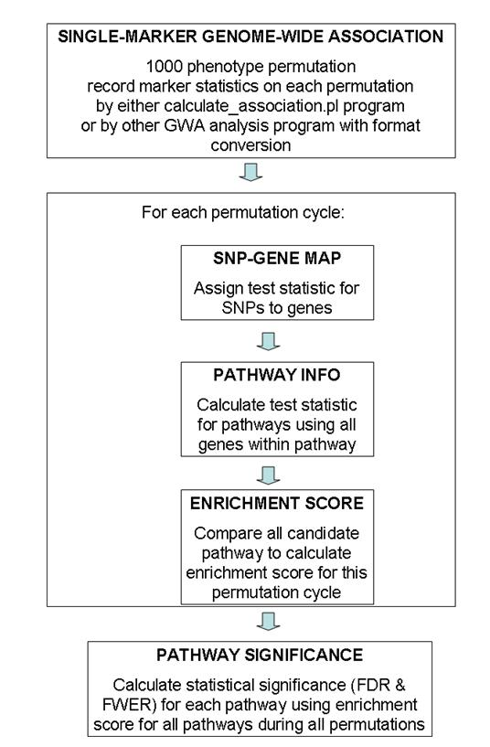

## Introduction

The `calculate_gsea.pl` program take GWA association results (chi2 and P values for all markers for at least 1000 phenotype permutations), a SNP-to-gene mapping file, and a pathway annotation file to perform pathway-based association tests. The algorithm is adopted from the Gene Set Enrichment Analysis software (Subramanian et al. Gene set enrichment analysis: a knowledge-based approach for interpreting genome-wide expression profiles. PNAS, 102:15545-15550, 2005) with certain modifications.

Briefly, the method does not focus on the top 20-50 SNPs with the strongest evidence of association; instead, it looks at all SNPs (and their neighboring genes) and sees whether SNPs within a particular biological pathway show consistently, albeit subtle, trend toward association. As there is no straightforward way of condensing test statistic from multiple SNPs into a statistic value for a gene, the method simply assign the best P-value of all SNPs near a gene to the gene but use phenotype-based permutation for adjusting statistical significance. The most significantly associated pathways can be identified from a set of candidate pathways, together with statistical significance calculated from permutation procedure.

The algorithm and software may be further improved and extended to be more sensitive and powerful. Several areas of improvements may include: (1) better method for condensing test statistic for SNPs to test statistic for genes; (2) better testing statistics for enrichment analysis that takes into account of overlapping pathways and is more powerful than the default Kolmogorov-Smirnov-like running sum; (3) possibility of skipping the snp-gene mapping step and directly test on SNPs within the same functional pathway; (4) use directed acyclic graph or interaction network to take into account of gene-gene correlation and interactions; (5) better pathway-annotation, especially taking protein-protein interaction data, transcriptional network data and other types of relationship data for testing candidate pathways; (6) combining multiple data sets (possibly with different genotyping platform) on the same or similar disease for pathway-based association tests. We believe that the further development of pathway-based approaches that incorporate and weigh prior biological knowledge, including those gleaned from model organisms, will greatly facilitate the interpretation of GWA data and will lead to the identification of novel disease susceptibility genes and mechanisms.

To read the detailed documentation of the program, one can use the --man argument when running the program. To see a list of arguments and their functionalities, one can use the --help argument when running the program. When the program is issued without arguments, it will print out abbreviated usage information, including supported arguments (Try to do it now to see a list of currently supported arguments and their functions).

Note that you can use both double dash or single dash in the command line (so `--output` has the same meaning as `-output`), and you can omit trailing letters of the argument as long as there is no ambiguity with another argument (so the `--output` argument has the same meaning as the `-o` or `-ou` or `-out` or `-outp` or `-outpu` argument).

## General overview of data flow patterns



A general overview of the testing procedure used in this program is given in the above figure. This program uses permutation extensively, so the entire procedure is computationally extremely expensive. Generally speaking, I recommended using 100 permutation cycles on 10 computational nodes (totaling 1000 permutation cycles) for generating GWA test statistic values, then run `calculate_gsea.pl` program on each of the 10 association results files and record 10 log files, finally use the combine_gsea.pl program to combine the 10 log files together to generate the pathway significance file. (The need to run 100 permutations on 10 computational nodes is a practical one: for a 4000 sample study with 500K SNP markers, it takes 24-48 hours to finish 100 permutation cycles by the calculate_association.pl program). The entire procedure takes up to 3 days for this set up, which is generally acceptable.

## Input files

The program requires three main input files, an association results file, an association permutation results file, a SNP-gene mapping file and a pathway definition file. Their formats are briefly described below.

### - Association results file

The association results file contains chi2 values (or alternatively, P-value) for genome-wide association tests on all markers to be tested in pathway-based approaches. It has a simple two-column format separated by tab character: the first column is marker name, while the second column is the chi2 value.

An example file is shown below:

```
[kai@adenine example]$ head gsea.chi2 
Marker  CHI2
rs2977670       3.386
rs3934834       2.628
rs3766193       1.573
rs3737728       0.5062
rs6687776       0.8587
rs6678318       0.8016
rs9651273       2.178
rs4970405       0.5791
rs12726255      5.813
```

If you happen to use `calculate_association.pl` program to calculate the chi2 and P-values in 1000 permutation cycles, this file can indeed be easily generated from the association permutation results file (see below), by taking the second and sixth column of the association permutation results file.

### - Association permutation results file

The permutation results file contains test statistic values for all SNPs for all permutation cycles, with one marker per line. The first line of the permutation file is called header line, and this line tells the program which column is the correct column to use for association results in the subsequent lines.

To explain this in more detail, see the first 10 lines of a permutation results file below:

```
[kai@adenine ~/usr/kgenome/trunk/example]$ head gsea.cc10 
Marker       Chr   Position          A:B   case_AF  control_AF    CHI2    CHI2_P CHI2_PERM      CHI2_P_PERM
rs2977670      1     763754          C:G   0.02988   0.01245     3.386     0.184        ,2.495,1.518,1.499,2.567,1.053,0.9854,5.399,1.518,0.9991,6.984  ,0.2872,0.4682,0.4725,0.2771,0.5907,0.611,0.06725,0.4682,0.6068,0.03044
rs3934834      1    1045729          C:T    0.8669    0.8523     2.628    0.2687        ,1.237,2.286,3.006,2.212,1.365,2.322,6.413,1.143,4.763,0.9403   ,0.5388,0.3189,0.2225,0.3309,0.5053,0.3132,0.04049,0.5647,0.09239,0.6249
rs3766193      1    1057093          C:G    0.5685    0.5775     1.573    0.4554        ,0.1177,1.826,0.1623,1.696,1.341,1.842,2.355,0.2308,4.827,3.819 ,0.9428,0.4014,0.9221,0.4283,0.5114,0.3982,0.3081,0.891,0.08949,0.1482
rs3737728      1    1061338          C:T    0.7491    0.7362    0.5062    0.7764        ,0.8074,2.252,0.6411,0.6818,2.305,0.5168,0.9075,3.028,2.964,0.3785      ,0.6678,0.3244,0.7257,0.7111,0.3158,0.7723,0.6352,0.22,0.2272,0.8276
rs6687776      1    1070488          C:T    0.8352    0.8376    0.8587    0.6509        ,1.643,2.162,1.336,5.999,1.039,1.994,0.6144,6.577,0.1056,0.307  ,0.4399,0.3393,0.5128,0.0498,0.5949,0.369,0.7355,0.0373,0.9486,0.8577
rs6678318      1    1070556          A:G    0.1648    0.1611    0.8016    0.6698        ,1.358,1.973,1.246,6.602,0.9562,2.009,0.7184,6.66,0.09339,0.4395        ,0.5072,0.3729,0.5364,0.03684,0.62,0.3663,0.6982,0.03579,0.9544,0.8027
rs9651273      1    1071463          A:G    0.2519    0.2889     2.178    0.3365        ,0.271,0.184,13.01,1.524,0.04583,0.3561,1.945,2.916,1.081,0.2136        ,0.8733,0.9121,0.001493,0.4667,0.9773,0.8369,0.3782,0.2327,0.5825,0.8987
rs4970405      1    1088878          A:G    0.8848    0.8875    0.5791    0.7486        ,2.743,2.609,0.5305,5.471,2.086,2.068,2.609,2.117,0.8489,0.9476 ,0.2538,0.2713,0.767,0.06486,0.3523,0.3556,0.2713,0.3469,0.6541,0.6226
rs12726255     1    1089873          A:G    0.8519    0.8487     5.813   0.05467        ,0.503,2.784,2.892,9.033,0.7313,1.991,0.4316,2.114,0.2846,0.2335        ,0.7776,0.2486,0.2355,0.01093,0.6938,0.3695,0.8059,0.3475,0.8674,0.8898
```

Each line contains 10 tab-delimited columns, and the first three columns are general description of the SNP marker, while the rest columns are information on the markers in the data set. The calculate_gsea.pl program will look for the CHI2_PERM label (the ninth column) in the header line, and then take the ninth column in every subsequent line for analysis. This column contains 10 numbers separated by comma, representing 10 chi2 values generated from 10 permutation cycles.

If you use other GWA program (such as PLINK) to perform the association tests, you can use 1000 randomly generated phenotype description files and feed them into PLINK for association analysis, then take all the association results, and then reformat them into the above file format. Note only the “Marker” column and the “CHI2_PERM” column are necessary for `calculate_gsea.pl` program to work properly, so you do not need to generate other columns.

### - SNP-gene mapping file

The SNP-gene mapping file is another tab-delimited file, with three columns per line: SNP name, gene name and SNP-gene distance. I have provided several SNP-gene mapping files for markers in the Illumina and Affymetrix SNP arrays.

For example, for the HumanHap550 array, several files are provided: `hh550.hg18.snpgenemap` and `hh550.hg18.snpgenemap.exp20k`. The difference is in how “gene” is defined: `hh550.hg18.snpgenemap` considers a gene as a RefSeq transcript, but `hh550.hg18.snpgenemap.exp20k` considers a gene as a RefSeq transcript plus the 20kb upstream and plus the 20kb downstream.

To explain this more clearly, consider a transcript that is located in chromosome 1 from base position 3000 to position 4000 (total length is 1000 base pairs). Although various databases (such as UCSC Gene or RefSeq Gene) call it as a "gene", in reality it is just a transcribed sequence. So if there is a transcription factor binding site at base position 2950 (50 bp upstream of the transcription start site), the TFBS will be considered as outside of the "gene". Many people believe that this is not the correct way to define gene, and they argue (based on many studies on cis regulatory elements) that 20kb up and downstream should all be defined as part of the "gene". This is the reason why I provide two different versions of the SNP-gene mapping file.

Note that in the program, the user can also specify the -distance argument to filter out SNPs that are far away from genes to be considered in the pathway analysis, as SNPs that are close to a "gene" can be used to represent the significance of the gene. So if a user use `-distance 100000` argument and the `--mapfile hh550.hg18.snpgenemap.exp20k` argument, the effect would be almost the same as using `-distance 120000` argument and the `--mapfile hh550.hg18.snpgenemap` argument.

### - Pathway definition file

The pathway definition file is a tab-delimited file, with one pathway per line. The first two columns are the pathway id, pathway description, while the following columns are gene identifiers within the pathway. Note that many gene synonyms could exist in the same pathway; for example, the SwissProt identifier, RefSeq identifier and HGNC identifier for the same gene may all show up in the same pathway. It does not really matter, because the SNP-gene mapping file is used for mapping SNP to the desired gene identifier. However, caution should be made that one cannot use the number of gene symbols in a pathway to represent the number of genes within the pathway. An example pathway file is shown below with two lines (two pathways):

```
GO0015884       GO0015884       FLOT1   FOLR    FOLR1   FOLR1_HUMAN     FOLR2   FOLR2_HUMAN     FOLR3   FOLR3_HUMAN     GP36    MFT     MFTC    MFTC_HUMAN      P14207  P14207_HUMAN    P15328  P15328_HUMAN    P41439  P41439_HUMAN    P41440  P41440_HUMAN    PDPN    PDPN_HUMAN      PSEC0003        PSEC0025        Q86YL7  Q86YL7_HUMAN    Q9H2D1  Q9H2D1_HUMAN    RFC1    S19A1_HUMAN     SLC19A1 SLC25A32
GO0007447       GO0007447       DVL2    DVL2_HUMAN      O14641  O14641_HUMAN
```

The IDs of the two pathways are GO0015884 and GO0007447, respectively. I have provided several pathway files in the program package that contains ~2000 pathways, compiled from Gene Ontology database, BioCarta database and the KEGG database. In most cases, you can just use my compiled pathway file for a regular genome-wide association study. You can also test your own candidate pathway, by making a simple tab-delimited file: note that the first two columns are pathway ID and pathway description, respectively, and all other columns are regarded as gene names.

Another source of pathway collection is the MSigDB database, available at http://www.broad.mit.edu/gsea/msigdb/collections.jsp. The C2 and C5 gene collections are probably most relevant for genome-wide association studies. (Note that the C5 collection is also a Gene Ontology collection, but MSigDB does not use level 4 annotation, and instead combines all levels of annotation together.)

Note that in previous distribution of this software package, all the pathways are contained within a single file. In the new version, three separate files are provided for each pathway source, so that users can easily test pathway enrichment on preferred pathway sources. The BioCarta and KEGG are compiled manually, so they are of much higher quality than the GO annotations; however, GO relies on both computer prediction and human annotation using various source of knowledge, including those gleaned from model organisms, so it provides a more broad spectrum of gene sets for testing enrichment. The GO file provided in this package is from GO level 4 in the hierarchy of Biological Process and Molecular Function.

## Testing procedure

### - Testing individual permutation results files

As mentioned before, performing 1000 permutations for GWA is very time-consuming, and follow-up calculate_gsea.pl also requires large amounts of memory for the 1000 permutations; therefore, it is generally recommended to split your job into 10 parts, each with 100 permutations. We can run the `calculate_gsea.pl` program on each part separately, each time generating a log file, and then use the `combine_gsea.pl` to combine the 10 log files together to generate a single test statistics for all candidate pathways.

An example of testing individual permutation results file is shown below:

```
[kai@adenine ~/]$ calculate_gsea.pl gsea.chi2 gsea.gmt -map gsea.snpgenemap -perm gsea.cc10
NOITCE: Reading gene/snp-stat-file gsea.chi2 ... Done with 49999 records (1 records skipped due to unrecognizable format)
NOTICE: Reading snp-gene-map file gsea.snpgenemap ... Done with 2580 genes and 48210 SNPs (1789 SNPs droppped due to lack of gene mapping)
NOTICE: Reading GeneSet file gsea.gmt ... Done with 9 gene sets that meet the size criteria (min=20 max=200)
NOTICE: Reading permutation file gsea.cc10 ... Automatically setting --cycle argument to 10 ... Done with permuted statistic values for 48210 SNPs!
Rearranging SNP stat values ... Done!
NOTICE: permutation cycle 1 done!
NOTICE: permutation cycle 2 done!
NOTICE: permutation cycle 3 done!
NOTICE: permutation cycle 4 done!
NOTICE: permutation cycle 5 done!
NOTICE: permutation cycle 6 done!
NOTICE: permutation cycle 7 done!
NOTICE: permutation cycle 8 done!
NOTICE: permutation cycle 9 done!
NOTICE: permutation cycle 10 done!
<-----------------Ranked list of over-represented gene sets/pathways-------------------------->
Geneset=GO0043085       Size=24         ES=0.460        NES=2.564       NominalP=0.000  FDR=0.000       FWER=0.000
Geneset=GO0006796       Size=115        ES=0.355        NES=1.462       NominalP=0.100  FDR=0.200       FWER=0.300
Geneset=GO0008544       Size=38         ES=0.344        NES=1.012       NominalP=0.200  FDR=0.500       FWER=0.700
Geneset=GO0019752       Size=45         ES=0.368        NES=0.770       NominalP=0.200  FDR=0.550       FWER=0.800
Geneset=GO0006520       Size=28         ES=0.348        NES=0.749       NominalP=0.200  FDR=0.460       FWER=0.800
Geneset=GO0009913       Size=27         ES=0.245        NES=0.697       NominalP=0.400  FDR=0.417       FWER=0.800
Geneset=GO0048878       Size=24         ES=0.441        NES=-0.011      NominalP=0.700  FDR=0.714       FWER=1.000
Geneset=GO0008284       Size=24         ES=0.282        NES=-2.243      NominalP=1.000  FDR=1.000       FWER=1.000
Geneset=GO0006118       Size=44         ES=0.231        NES=-2.316      NominalP=1.000  FDR=1.000       FWER=1.000
```

The above example shows an example of running the program. First the association results file is read (the first record is the “Marker chi2” record and is therefore skipped due to lack of number in the second column of the gsea.chi2 file). In the next step, the snp-gene-mapping file gesa.snpgenemap is read. By default, the --dist 500k argument is in effect, so some SNPs that cannot be mapped to a gene, or cannot be mapped to a gene within 500k are dropped from analysis. In the third step, the gene set file gsea.gmt is read, but by default we only process sets with between 20 and 200 genes (these genes are those in the snp-gene mapping file). In the fourth step, the permutation statistic values for all the remaining SNPs are read from the gsea.cc10 file, which contains chi2 values for 10 permutation cycles. Now each of the permutation cycle is analyzed and enrichment score is calculated, and finally all the pathways are scored. The results are sorted by the NES (normalized enrichment score), and the normal P-value, the FDR value and the FWER P-value for each pathway is printed in the same line. Note that the formula for FDR and FWER calculation can be found in our previous publication and also in the original GSEA publication. (Despite the name, FWER does not mean Bonferroni adjustment, as many people would assume)

To change the default snp-gene distance threshold, one can use the `--distance` argument. To change the default gene set size, one can use the `--setmin` and `--setmax` arguments.

One can use the `--log` argument to save the results to a log file, so that multiple log files can be used in the next step.

### - Combining log files together to recalculate enrichment statistics

Suppose 10 permutation results (each containing statistics for 100 permutations) files are analyzed by the calculate_gsea.pl program, and 10 log files are generated by each run. To combine the results from all 1000 permutations, one can simply do:

```
[kai@adenine ~/]$ combine_gsea.pl *.log
```

So all 10 log files will be jointly analyzed, and a final pathway significance values will be calculated. Here the same -setmin and -setmax argument can be used. For example, the command below

```
[kai@adenine ~/]$ combine_gsea.pl -setmin 50 *.log
```

will test all gene sets that contains at least 50 genes. However, note that the use of -setmin depends on how the \*.log files are generated. By default the -setmin 20 argument is in effect in the calculate_gsea.pl program; therefore, it is legitimate to use a more stringent threshold of `-setmin 50`, but using a `-setmin 10` woud make no difference at all.

## Tweaking parameters

Multiple parameters and files can be tweaked in the program, and they may generate quite different enrichment results. Below I briefly describe several changes that can be made in the association calculation.

First, the association results file can be changed to exclude certain SNP markers. This program (of course) only tests the SNPs that are both in the association results file and in the association permutation results file. By simply excluding certain markers from the association results file, we would be only testing a subset of SNP markers and their surrounding genes. For this reason, when generating the permutation file, one should generally be using highly flexible exclusion criteria so that as many markers can be tested and recorded in the permutation file as possible (consider even using the --allmarker --cell 0 argument when running calculate_association.pl program). One can then remove markers from the association results file to selectively test a subset of markers; for example, markers with MAF (minor allele frequency)>0.05, with HWE (Hardy-Weinberg equilibrium) P>0.001, and with genotyping non-call rate < 0.01. (In addition, one can probably even also select all markers with association P value < 0.05 and only test on this subset of markers. I have not tested this idea). An additional note is that, for case-control studies, it is okay to use MAF>0.01 (default parameter for calculate_association.pl program and PLINK program), but for family-based association studies, it might be better idea to use MAF>0.05 or even higher (since under same sample size, it is much more difficult to achieve high chi2 values for family-based association studies for markers with low heterozygosity, which are difficult to be found to be transmitted from heterozygous parents).

Next, the testing strategy can be changed for case-control studies. Right now the default association test is the allelic association test in the calculate_association.pl program and in PLINK program, but maybe the genotypic association test (or trend test) is more powerful (and less biased by genotyping error) in the case of large sample size. If you use calculate_association.pl program for case-control studies, then the --perm_method argument can be used to specify the permutation testing strategy.

Third, the SNP-gene mapping file can be changed and the SNP-gene distance can be changed. I now provide multiple files for the commonly used genotyping platform, including Illumina HumanHap550 (v1 and v3 together) and Affymetrix Mapping 500K, genome-wide 5.0 and genome-wide 6.0 arrays. There are multiple gene annotation system for mapping SNPs to genes (for example, the Ensembl gene annotation, the UCSC known gene annotation, and the RefSeq gene annotation), and there are two possible genome build for such mapping (the 2004 and 2006 human genome build). In generally, I recommend using only the 2006 human assembly and only the RefSeq gene annotation, which are more popularly than other annotation systems. In addition, the --dist 500k argument should be used in calucate_gsea.pl, meaning that only SNPs within 500kb from a gene are used in analysis, because we do not want to use too many SNPs around large genes, or inappropriately assigning SNPs within un-annotated gene deserts to an unrelated gene.

Finally, the pathway annotation file can be supplemented or even replaced. Right now several files are included in the package from GO level 4 annotation, the BioCarta database and the KEGG database. However, users may have much better gene pathways/sets annotations based on expert compilation or based on high-throughput techniques (such as co-regulated genes in microarray experiments and so on). As mentioned before, the gene set size can be also tweaked by the --setmin and --setmax arguments; note that gene set size is dependent on the actual ensemble of SNPs used in the analysis and will be different between different studies using different array platforms.

## Other functionality of the program

In the absence of a permutation association results file, the calculate_gsea.pl can apply genotype-based permutation, that is, permutating the P-values and chi2 values between SNPs. This is not really recommended for SNP arrays with high marker-marker linkage disequilibrium (LD) patterns, as such permutation disrupts the LD structure and may generate biased results. Whenever possible, please use raw genotype data to performed phenotype permutation and re-calculate GWA statistics, before using the calculate_gsea.pl program.

In general, one can also use the calculate_gsea.pl program for microarray data analysis, because it also implements the original GSEA algorithm, including the pre-ranked module of the original GSEA algorithm. However, the original authors of GSEA also provide software for such analysis (Subramanian et al, GSEA-P: a desktop application for Gene Set Enrichment Analysis. Bioinformatics, 23:3251-3253, 2007), which is written in Java and is far more user-friendly than my program. Unless the user wants to tweak my program for more customized analysis or more automated analysis on huge data sets, the Java program is probably a better choice for microarray data analysis. These two programs do generate highly similar results on identical data sets.

## Technical notes

### - The use of `--weight` argument

The `--weight` argument corresponds to the p value in the GSEA enrichment score calculation formula. By default, this parameter is chosen as 1, which is identical as the original GSEA publication in PNAS for microarray data. However, for GWAS data, other values could be explored and see how results change.

This paragraph was copied from the PNAS paper verbatim and it explains the rationale of different choices of p parameter: “For example, if one is interested in penalizing sets for lack of coherence or to discover sets with any type of nonrandom distribution of tags, a value p < 1 might be appropriate. On the other hand, if one uses sets with large number of genes and only a small subset of those is expected to be coherent, then one could consider using p > 1. Our recommendation is to use p = 1 and use other settings only if you are very experienced with the method and its behavior.”

In practical settings of GWAS studies, the value of 1 still seems to be a reasonable choice for testing. The most appropriate choice will probably need to be dependent on the disease model: if it is indeed a complex disease without any single variant achieving significance, then default p should be used. If a few variants achieves very high significance (for example, diseases like type 1 diabetes and ulcerative colitis with a large HLA involvement), then a large p parameter will easily bring the pathway containing the SNPs to the top ranked list.

### - The use of `--traditional` argument

The `--traditional` argument signals the program to use the same normalized enrichment score calculation method as the PNAS paper on microarray data, and use the same dichotomization method for FDR/FWER calculation. This makes sense for microarray data analysis, since genes expression in a pathway could be both up-regulated or down-regulated; however, for GWAS studies, the lack of significance for SNPs within a pathway is not biologically interesting or interpretable.

 

